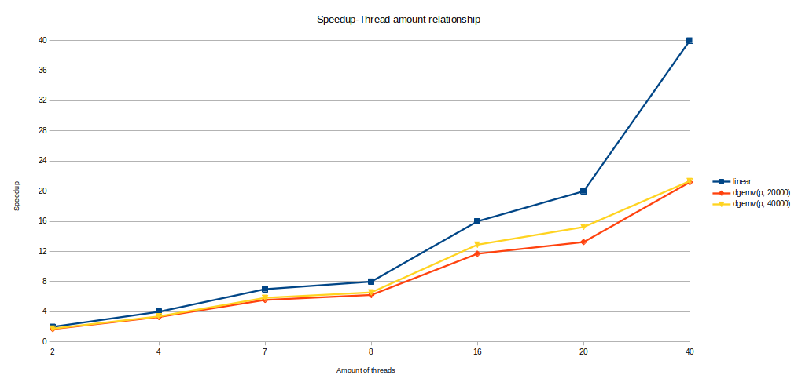

# Отчёт

## Описание нод

    Model name:                     Intel(R) Xeon(R) Gold 6248 CPU @ 2.50GHz
    CPU(s):                         80

    Server name:                    ProLiant XL270d Gen10
                    
    NUMA node(s):                   2
    NUMA node0 CPU(s):              0-19,40-59
    NUMA node1 CPU(s):              20-39,60-79

    node 0 size:                    385636 MB
    node 0 free:                    105947 MB

    node 1 size:                    387008 MB
    node 1 free:                    232013 MB

    OS:                             Ubuntu 22.04.5 LTS

## Результаты

<table style="text-align: center;">
    <tr style="background-color:rgb(235, 235, 235);">
        <td rowspan="3">
        Matrix size (M=N)
        </td>
        <td colspan="15">
        Threads
        </td>
    </tr>
    <tr style="background-color:rgb(235, 235, 235);">
        <td>
        1
        </td>
        <td colspan="2">
        2
        </td>
        <td colspan="2">
        4
        </td>
        <td colspan="2">
        7
        </td>
        <td colspan="2">
        8
        </td>
        <td colspan="2">
        16
        </td>
        <td colspan="2">
        20
        </td>
        <td colspan="2">
        40
        </td>
    </tr>
    <tr style="background-color:rgb(235, 235, 235);">
        <td>
        T(1), s
        </td>
        <td>
        T(2), s
        </td>
        <td>
        S(2)
        </td>
        <td>
        T(4), s
        </td>
        <td>
        S(4)
        </td>
        <td>
        T(7), s
        </td>
        <td>
        S(7)
        </td>
        <td>
        T(8), s
        </td>
        <td>
        S(8)
        </td>
        <td>
        T(16), s
        </td>
        <td>
        S(16)
        </td>
        <td>
        T(20), s
        </td>
        <td>
        S(20)
        </td>
        <td>
        T(40), s
        </td>
        <td>
        S(40)
        </td>
    </tr>
    <tr>
        <td style="background-color:rgb(235, 235, 235);">
        20 000   (~3 GiB)
        </td>
        <td>
        ~1.06
        </td>
        <td>
        ~0.62
        </td>
        <td>
        ~1.71
        </td>
        <td>
        ~0.32
        </td>
        <td>
        ~3.31
        </td>
        <td>
        ~0.19
        </td>
        <td>
        ~5.57
        </td>
        <td>
        ~0.17
        </td>
        <td>
        ~6.23
        </td>
        <td>
        ~0.09
        </td>
        <td>
        ~11.7
        </td>
        <td>
        ~0.08
        </td>
        <td>
        ~13.25
        </td>
        <td>
        ~0.05
        </td>
        <td>
        ~21.2
        </td>
    </tr>
    <tr>
        <td style="background-color:rgb(235, 235, 235);">
        40 000   (~12 GiB)
        </td>
        <td>
        ~4.27
        </td>
        <td>
        ~2.41
        </td>
        <td>
        ~1.77
        </td>
        <td>
        ~1.26
        </td>
        <td>
        ~3.39
        </td>
        <td>
        ~0.73
        </td>
        <td>
        ~5.85
        </td>
        <td>
        ~0.65
        </td>
        <td>
        ~6.57
        </td>
        <td>
        ~0.33
        </td>
        <td>
        ~12.9
        </td>
        <td>
        ~0.28
        </td>
        <td>
        ~15.25
        </td>
        <td>
        ~0.20
        </td>
        <td>
        ~21.35
        </td>
    </tr>
</table>

## Вывод

Используя потоки, программа успешно масштабируется. Но, как мы видим на графике ниже, мы не можем достичь линейного соотношения S(p)/p за счет увеличения количества потоков. В какой-то момент увеличение потока становится все менее полезным для масштабирования.

