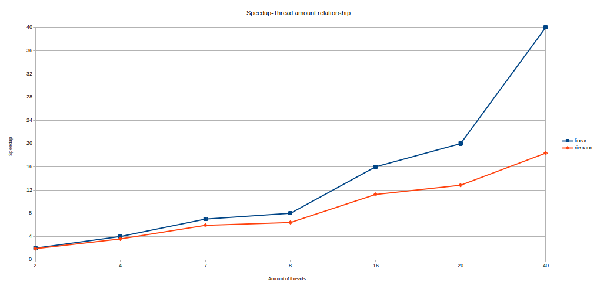

# Отчёт

## Описание нод

    Model name:                     Intel(R) Xeon(R) Gold 6248 CPU @ 2.50GHz
    CPU(s):                         80

    Server name:                    ProLiant XL270d Gen10
                    
    NUMA node(s):                   2
    NUMA node0 CPU(s):              0-19,40-59
    NUMA node1 CPU(s):              20-39,60-79

    node 0 size:                    385636 MB
    node 0 free:                    105947 MB

    node 1 size:                    387008 MB
    node 1 free:                    232013 MB

    OS:                             Ubuntu 22.04.5 LTS

## Результаты

<table style="text-align: center;">
    <tr style="background-color:rgb(235, 235, 235);">
        <td rowspan="3">
        Interval
        </td>
        <td rowspan="3">
        Number of steps
        </td>
        <td colspan="15">
        Threads
        </td>
    </tr>
    <tr style="background-color:rgb(235, 235, 235);">
        <td>
        1
        </td>
        <td colspan="2">
        2
        </td>
        <td colspan="2">
        4
        </td>
        <td colspan="2">
        7
        </td>
        <td colspan="2">
        8
        </td>
        <td colspan="2">
        16
        </td>
        <td colspan="2">
        20
        </td>
        <td colspan="2">
        40
        </td>
    </tr>
    <tr style="background-color:rgb(235, 235, 235);">
        <td>
        T(1), s
        </td>
        <td>
        T(2), s
        </td>
        <td>
        S(2)
        </td>
        <td>
        T(4), s
        </td>
        <td>
        S(4)
        </td>
        <td>
        T(7), s
        </td>
        <td>
        S(7)
        </td>
        <td>
        T(8), s
        </td>
        <td>
        S(8)
        </td>
        <td>
        T(16), s
        </td>
        <td>
        S(16)
        </td>
        <td>
        T(20), s
        </td>
        <td>
        S(20)
        </td>
        <td>
        T(40), s
        </td>
        <td>
        S(40)
        </td>
    </tr>
    <tr>
        <td style="background-color:rgb(235, 235, 235);">
        [-2, 2]
        </td>
        <td style="background-color:rgb(235, 235, 235);">
        40 000 000
        </td>
        <td>
        ~0.46
        </td>
        <td>
        ~0.24
        </td>
        <td>
        ~1.91
        </td>
        <td>
        ~0.13
        </td>
        <td>
        ~3.58
        </td>
        <td>
        ~0.079
        </td>
        <td>
        ~5.92
        </td>
        <td>
        ~0.071
        </td>
        <td>
        ~6.41
        </td>
        <td>
        ~0.041
        </td>
        <td>
        ~11.24
        </td>
        <td>
        ~0.036
        </td>
        <td>
        ~12.83
        </td>
        <td>
        ~0.025
        </td>
        <td>
        ~18.36
        </td>
    </tr>
</table>

## Вывод

Как мы видим на графике ниже, небольшое использование потоков может привести к производительности, близкой к линейной. Но при увеличении количества потоков соотношение становится немного хуже до такой степени, что результаты крайне далеки от линейных значений.

