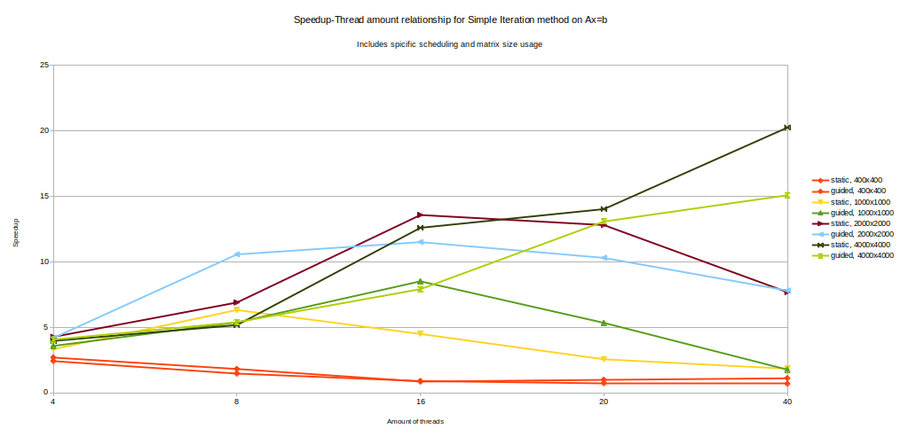

# Отчёт

## Описание нод

```
    Model name:                     Intel(R) Xeon(R) Gold 6248 CPU @ 2.50GHz
    CPU(s):                         80

    Server name:                    ProLiant XL270d Gen10
                    
    NUMA node(s):                   2
    NUMA node0 CPU(s):              0-19,40-59
    NUMA node1 CPU(s):              20-39,60-79

    node 0 size:                    385636 MB
    node 0 free:                    105947 MB

    node 1 size:                    387008 MB
    node 1 free:                    232013 MB

    OS:                             Ubuntu 22.04.5 LTS
```

## Результаты

*ПРИМЕЧАНИЕ:* В текущей реализации используются блоки размером **matrix_size / num_threads**, поэтому в данном случае нет существенной разницы между динамическим и управляемым (guided) планированием.

<style type="text/css">
    .tg-c3ow {
        background-color:rgb(235, 235, 235);
        font-weight: bold;
    }
    table {
        text-align: center;
    }
</style>
<table class="tg"><tdead>
  <tr>
    <td class="tg-c3ow" rowspan="3">Selected<br>schedule</td>
    <td class="tg-c3ow" rowspan="3">Matrix size<br>(M=N)</td>
    <td class="tg-c3ow" colspan="11">Thread amount</td>
  </tr>
  <tr>
    <td class="tg-c3ow">1</td>
    <td class="tg-c3ow" colspan="2">4</td>
    <td class="tg-c3ow" colspan="2">8</td>
    <td class="tg-c3ow" colspan="2">16</td>
    <td class="tg-c3ow" colspan="2">20</td>
    <td class="tg-c3ow" colspan="2">40</td>
  </tr>
  <tr>
    <td class="tg-c3ow">T(1), s</td>
    <td class="tg-c3ow">T(4), s</td>
    <td class="tg-c3ow">S(4)</td>
    <td class="tg-c3ow">T(8), s</td>
    <td class="tg-c3ow">S(8)</td>
    <td class="tg-c3ow">T(16), s</td>
    <td class="tg-c3ow">S(16)</td>
    <td class="tg-c3ow">T(20), s</td>
    <td class="tg-c3ow">S(20)</td>
    <td class="tg-c3ow">T(40), s</td>
    <td class="tg-c3ow">S(40)</td>
  </tr></tdead>
<tbody>
  <tr>
    <td class="tg-c3ow" rowspan="4">Static</td>
    <td class="tg-c3ow">400</td>
    <td>~0.11</td>
    <td>~0.042</td>
    <td>~2.68</td>
    <td>~0.06</td>
    <td>~1.81</td>
    <td>~0.27</td>
    <td>~0.85</td>
    <td>~0.12</td>
    <td>~0.98</td>
    <td>~0.1</td>
    <td>~1.10</td>
  </tr>
  <tr>
    <td class="tg-c3ow">1000</td>
    <td>~0.33</td>
    <td>~0.104</td>
    <td>~3.32</td>
    <td>~0.07</td>
    <td>~6.31</td>
    <td>~0.16</td>
    <td>~4.48</td>
    <td>~0.2</td>
    <td>~2.55</td>
    <td>~0.18</td>
    <td>~1.83</td>
  </tr>
  <tr>
    <td class="tg-c3ow">2000</td>
    <td>~1.13</td>
    <td>~0.330</td>
    <td>~4.26</td>
    <td>~0.3</td>
    <td>~6.88</td>
    <td>~0.09</td>
    <td>~13.56</td>
    <td>~0.08</td>
    <td>~12.79</td>
    <td>~0.14</td>
    <td>~7.67</td>
  </tr>
  <tr>
    <td class="tg-c3ow">4000<br></td>
    <td>~4.37</td>
    <td>~1.22</td>
    <td>~3.95</td>
    <td>~1.17</td>
    <td>~5.16</td>
    <td>~0.38</td>
    <td>~12.58</td>
    <td>~0.31</td>
    <td>~14.01</td>
    <td>~0.22</td>
    <td>~20.23</td>
  </tr>
  <tr>
    <td class="tg-c3ow" rowspan="4">Guided</td>
    <td class="tg-c3ow">400</td>
    <td rowspan="4">N/A</td>
    <td>~0.047</td>
    <td>~2.41</td>
    <td>~0.07</td>
    <td>~1.46</td>
    <td>~0.25</td>
    <td>~0.89</td>
    <td>~0.16</td>
    <td>~0.72</td>
    <td>~0.16</td>
    <td>~0.68</td>
  </tr>
  <tr>
    <td class="tg-c3ow">1000</td>
    <td>~0.097</td>
    <td>~3.57</td>
    <td>~0.08</td>
    <td>~5.36</td>
    <td>~0.08</td>
    <td>~8.50</td>
    <td>~0.09</td>
    <td>~5.33</td>
    <td>~0.19</td>
    <td>~1.76</td>
  </tr>
  <tr>
    <td class="tg-c3ow">2000</td>
    <td>~0.336</td>
    <td>~4.18</td>
    <td>~0.2</td>
    <td>~10.55</td>
    <td>~0.11</td>
    <td>~11.49</td>
    <td>~0.10</td>
    <td>~10.29</td>
    <td>~0.14</td>
    <td>~7.79</td>
  </tr>
  <tr>
    <td class="tg-c3ow">4000<br></td>
    <td>~1.2</td>
    <td>~4.05</td>
    <td>~1.12</td>
    <td>~5.38</td>
    <td>~0.60</td>
    <td>~7.90</td>
    <td>~0.33</td>
    <td>13.06</td>
    <td>~0.30</td>
    <td>~15.07</td>
  </tr>
</tbody></table>

## Вывод

Все правила распараллеливания были связаны с определенными циклами итерационного процесса:
`#pragma omp parallel for num_threads(N) schedule(sch)`

Масштабирование на графике выглядит нестабильным из-за небольших размеров матриц (упомянутых в таблице масштабирования выше) и того, как потоки заняты в момент инициализации. В результате, динамическое / управляемое (guided) распределение потоков может оказаться менее эффективным или не оказать никакого влияния, учитывая, что объем работы недостаточен для такого распределения.

