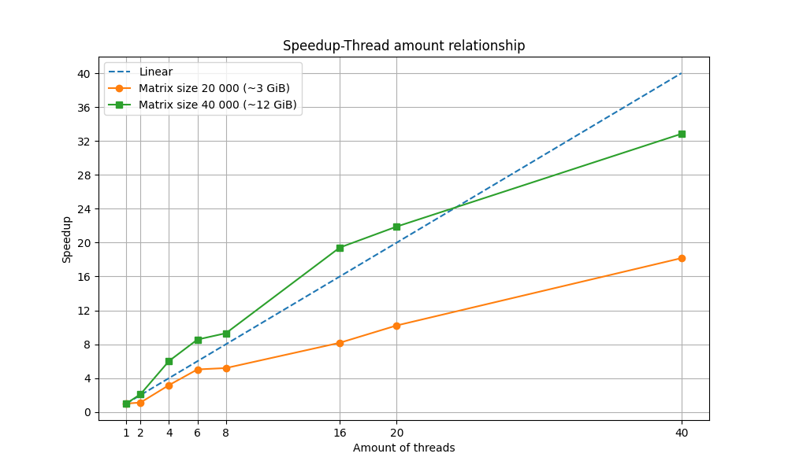

# Отчёт

## Описание нод

    Model name:                     Intel(R) Xeon(R) Gold 6248 CPU @ 2.50GHz
    CPU(s):                         80

    Server name:                    ProLiant XL270d Gen10
                    
    NUMA node(s):                   2
    NUMA node0 CPU(s):              0-19,40-59
    NUMA node1 CPU(s):              20-39,60-79

    node 0 size:                    385636 MB
    node 0 free:                    105947 MB

    node 1 size:                    387008 MB
    node 1 free:                    232013 MB

    OS:                             Ubuntu 22.04.5 LTS

## Результаты

<table style="text-align: center;">
    <tr style="background-color:rgb(235, 235, 235);">
        <td rowspan="3">
        Matrix size (M=N)
        </td>
        <td colspan="15">
        Threads
        </td>
    </tr>
    <tr style="background-color:rgb(235, 235, 235);">
        <td>
        1
        </td>
        <td colspan="2">
        2
        </td>
        <td colspan="2">
        4
        </td>
        <td colspan="2">
        6
        </td>
        <td colspan="2">
        8
        </td>
        <td colspan="2">
        16
        </td>
        <td colspan="2">
        20
        </td>
        <td colspan="2">
        40
        </td>
    </tr>
    <tr style="background-color:rgb(235, 235, 235);">
        <td>
        T(1), s
        </td>
        <td>
        T(2), s
        </td>
        <td>
        S(2)
        </td>
        <td>
        T(4), s
        </td>
        <td>
        S(4)
        </td>
        <td>
        T(7), s
        </td>
        <td>
        S(7)
        </td>
        <td>
        T(8), s
        </td>
        <td>
        S(8)
        </td>
        <td>
        T(16), s
        </td>
        <td>
        S(16)
        </td>
        <td>
        T(20), s
        </td>
        <td>
        S(20)
        </td>
        <td>
        T(40), s
        </td>
        <td>
        S(40)
        </td>
    </tr>
    <tr>
        <td style="background-color:rgb(235, 235, 235);">
        20 000   (~3 GiB)
        </td>
        <td>
        ~3.27
        </td>
        <td>
        ~2.92
        </td>
        <td>
        ~1.12
        </td>
        <td>
        ~1.03
        </td>
        <td>
        ~3.78
        </td>
        <td>
        ~0.65
        </td>
        <td>
        ~5.98
        </td>
        <td>
        ~0.63
        </td>
        <td>
        ~6.05
        </td>
        <td>
        ~0.40
        </td>
        <td>
        ~9.65
        </td>
        <td>
        ~0.32
        </td>
        <td>
        ~10.79
        </td>
        <td>
        ~0.18
        </td>
        <td>
        ~21.95
        </td>
    </tr>
    <tr>
        <td style="background-color:rgb(235, 235, 235);">
        40 000   (~12 GiB)
        </td>
        <td>
        ~22.33
        </td>
        <td>
        ~10.62
        </td>
        <td>
        ~2.10
        </td>
        <td>
        ~3.71
        </td>
        <td>
        ~6.00
        </td>
        <td>
        ~2.61
        </td>
        <td>
        ~6.11
        </td>
        <td>
        ~2.40
        </td>
        <td>
        ~7.70
        </td>
        <td>
        ~1.15
        </td>
        <td>
        ~16.58
        </td>
        <td>
        ~1.02
        </td>
        <td>
        ~16.62
        </td>
        <td>
        ~0.68
        </td>
        <td>
        ~22.82
        </td>
    </tr>
</table>

## Вывод

При 8 потоках ускорение для матрицы 20000 x 20000 составляет ~0.63, а при 16 потоках — ~0.40. Это указывает на то, что дальнейшее увеличение количества потоков (например, до 20 или 40) приводит к снижению эффективности из-за накладных расходов.
Для данной задачи использование более 16 потоков нецелесообразно, так как ускорение практически не улучшается, а накладные расходы на синхронизацию и управление потоками начинают преобладать.

При 16 потоках ускорение для матрицы 40000 x 40000 составляет ~1.15, а при 20 потоках — ~1.02. Это указывает на то, что задача лучше масштабируется на большее количество потоков по сравнению с матрицей 20000x20000.
Однако при увеличении количества потоков до 40 ускорение достигает ~0.68, что указывает на снижение эффективности. Это связано с тем, что накладные расходы начинают преобладать над выигрышем от параллелизации.

